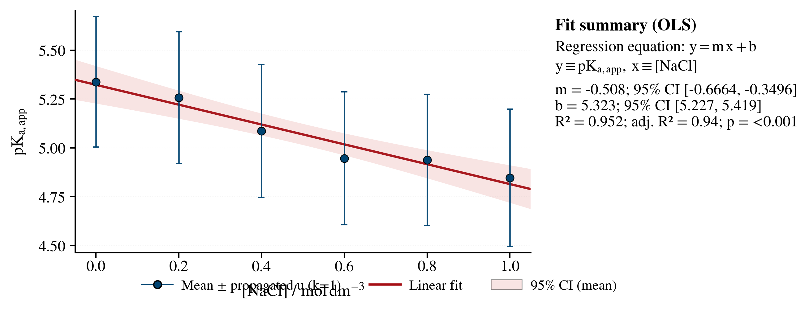

### Ionic Strength Effects on Ethanoic Acid Titration Behavior

We investigated how sodium chloride concentration affects the apparent acid dissociation constant ($K_a$) of ethanoic acid. We processed potentiometric titration data, determined equivalence points via derivative analysis, and applied a linearized Henderson-Hasselbalch model to quantify equilibrium shifts under varying ionic strengths.

[](docs/images/statistical_summary.png)

> [!NOTE]
> This repository contains the source code and data for my IBDP Chemistry SL Internal Assessment. It is not intended for public use, and should be used solely for educational purposes. However, you are free to explore the code and data for learning on your own.

#### Documentation

Comprehensive documentation is available in the [`docs/`](docs/) directory:

- **[Overview](docs/overview.md)** - Project scope and experimental design
- **[Getting Started](docs/getting-started.md)** - Installation and usage instructions
- **[Analysis Methods](docs/analysis-methods.md)** - Mathematical and statistical methods
- **[API Reference](docs/api-reference.md)** - Function and class documentation
- **[Troubleshooting](docs/troubleshooting.md)** - Common issues and solutions

#### Installation

1. Clone the repository:

   ```bash
   git clone https://github.com/cytronicoder/in-the-salt-mines.git
   cd in-the-salt-mines
   ```

2. Create a virtual environment (recommended):

   ```bash
   python3 -m venv .venv
   source .venv/bin/activate
   ```

3. Install dependencies:

   ```bash
   pip install -r requirements.txt
   ```

#### Usage

1. **Standard Analysis:** Run the main pipeline to process all raw data, perform the regression analysis, and generate figures.

   ```bash
   python main.py
   ```

2. **Verify Tests:** Ensure all analytical components are functioning correctly.

   ```bash
   pytest
   ```

3. **Output Artifacts:** Check the `output/` directory for results:
   - `individual_results.csv`: Per-run metrics ($pK_a$, $V_{eq}$, $R^2$, slope).
   - `statistical_summary.csv`: Aggregated results by NaCl concentration.
   - `provenance_map.csv`: file tracing.
   - `iterations/`: Subsets of data (All Valid, QC Pass, Strict Fit).

#### Analysis Methods

The project implements a rigorous potentiometric analysis pipeline:

- **Endpoint Detection:** Numerical differentiation (1st and 2nd derivatives) to locate $V_{eq}$
- **Buffer Modeling:** Linearized Henderson-Hasselbalch regression ($\text{pH}$ vs. $\log(V/(V_{eq}-V))$)
- **QC Filtering:** Automated rejection of runs with biochemical inconsistencies (e.g., $R^2 < 0.98$, slope deviations $> 20\%$)
- **Uncertainty Propagation:** Worst-case error propagation for derived concentrations and $pK_a$

See [Analysis Methods](docs/analysis-methods.md) for detailed mathematical descriptions.

#### Data Format

Input data is expected in the `data/raw/` directory. The pipeline supports Logger Pro style CSV exports containing at minimum:

- `Volume` (or similar, autocreated to `Volume (cm^3)`)
- `pH`
- `Temperature` (optional but recommended)

#### Requirements

- Python 3.9+
- numpy
- pandas
- matplotlib
- scipy
- seaborn

#### License

This project is licensed under the MIT License - see the [LICENSE](LICENSE) file for details.
