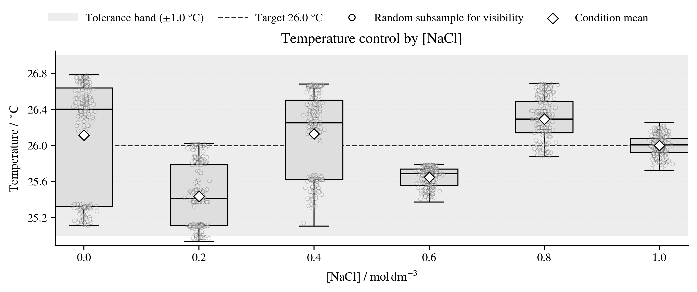
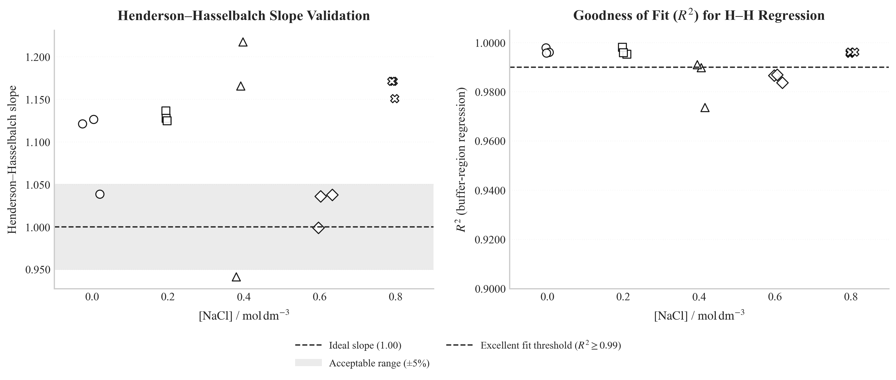
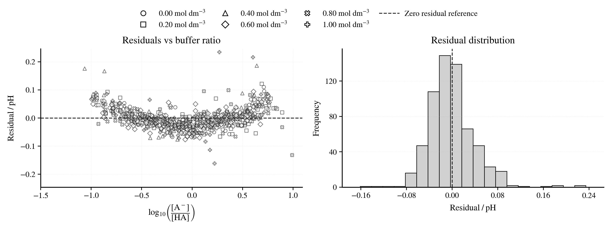
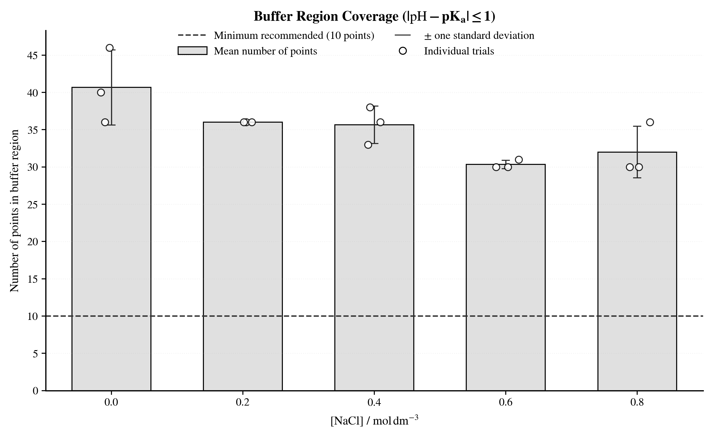
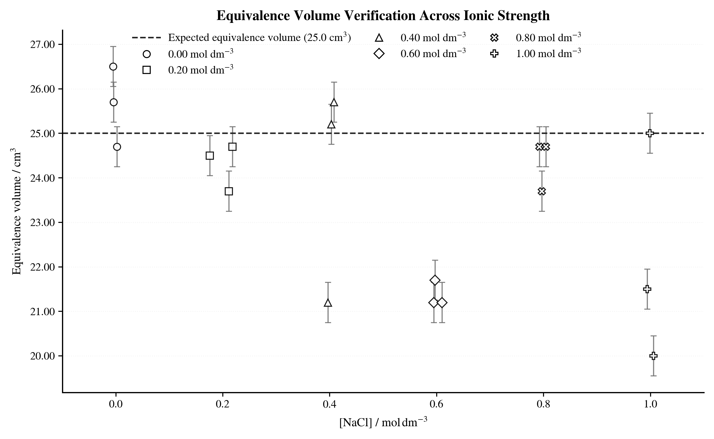
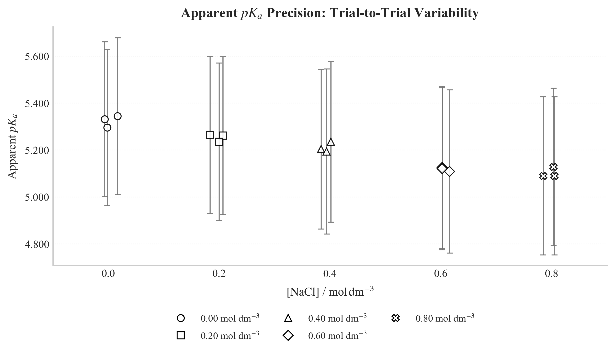

### Thermal Control Verification

**Figure 1:** Distribution of solution temperatures across all trials.
_Diagnostics:_ Confirms that measurements were performed within the target window ($26.0 \pm 1.0\ ^\circ\text{C}$) to minimize temperature-dependent equilibrium shifts.

### Regression Model Validity

**Figure 2:** Slope and coefficient of determination ($R^2$) for the linearized Henderson-Hasselbalch fits.
_Interpretation:_ Slopes near unity (ideal value $m=1$) and high $R^2$ values ($>0.98$) indicate that the weak-acid approximation holds well in the selected buffer regions.

**Figure 3:** Structure of residuals from the linearized fits.
_Interpretation:_ Randomly distributed residuals centered around zero suggest that no systematic error biases the buffer-region regression model.

### Endpoint and Buffer Region Sufficiency

**Figure 4:** Number of data points available within the valid buffer window used for regression.
_Check:_ Ensures sufficient data density (typically $n \ge 10$) to calculate a statistically robust intercept (apparent $pK_a$).

**Figure 5:** Consistency of determined equivalence volumes ($V_{eq}$) across salt concentrations.
_Check:_ Verifies that the stoichiometric endpoint remains stable and consistent with the prepared acid concentrations.

### Apparent Dissociation Constants

**Figure 6:** Calculated apparent $pK_a$ values across increasing sodium chloride concentrations.
_Observation:_ This figure visualizes the primary trend of the investigation, showing how ionic strength influences the dissociation equilibrium position, with error bars representing propagated uncertainty.
